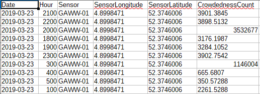

# Prediction Models to estimate crowdedness within Amsterdam
**Author**: [Don de Lange Msc.](mailto:delangedon@gmail.com?subject=[Github]%20Prediction%20Models%20Crowdedness)

## Abstract
Amsterdam is a crowded city, which increases the pressure on public services, public events and public spaces. Sensors were placed in the city to measure the crowdedness of pedestrians within small predetermined areas. This research aims to train prediction models that predict the crowdedness at and between predetermined locations within Amsterdam, at an hourly rate for each single day within a predetermined period. 

In order to train the prediction models, historical data from the following sources was used; (i) public transport data from predetermined stations (ii) crowdedness counts from sensors located at the predetermined locations (iii) dates of events within Amsterdam. 

The models used in this research were *Random Forest* and *XGBoost*, for both regression and classification. The regression models predicted the numerical pedestrian counts and the classification models predicted the crowdedness level of the pedestrians, based on the crowdedness distribution in the historical dataset. 

With the predictions made at the sensor locations, the *XGBoost* models outperformed the *Random Forest* models. 

As a method of testing the predictions between the known sensor locations, the models generalized the data of the known sensor locations to the unknown location. To evaluate the model performance, the data of a single sensor was removed during the training of the models and the crowdedness of that sensor was predicted during the evaluation phase. Which was repeated for each given sensor and the average performance results were evaluated. 

With the generalizations to unknown sensor locations, the regression *XGBoost* models also outperformed the regression *Random Forest* models. But, the performance of the classification *XGBoost* and classification *Random Forest* was equal. 

## Prediction
The predictions can be generated in two different forms:
- **Prediction for unknown dates**: The prediction will be made at a known location for unknown dates
- **Generalized prediction**: The prediction will be made at a unknown location for known dates

## Usage
- Clone or donwload the code
- Set the [Hyperparameter Settings](../ParamSettings)
    - [HParams.txt](../ParamSettings/HParams.txt): In this file the general hyperparameters can be set. These will affect all the scripts. 
        - State whether the combined dataset is present
        - State whether the trained models are present
        - State which sensors and stations to use for the prediction and training
        - Which prediction method to use
        - Which classification and regression models to use. 
    - [InputFilePaths.txt](../ParamSettings/InputFilePaths.txt): In this file the location of the needed import files can be set. 
    - [OutputFilePaths.txt](../ParamSettings/OutputFilePaths.txt): In this file the location of the the output files can be set. It's advised to leave these settings unchanged, as the directories to dave the files are made by the code. 
    - [ModelParams.txt](../ParamSettings/ModelParams.txt): In this file the model settings can be set. 
        - The size of the training and evaluation split
        - Number of cross validations
        - Hyperparameter grid set of the models
    - [PredParams.txt](../ParamSettings/PredParams.txt): In this file the prediction setttings can be set
        - Prediction period 
        - Prediction model
        - What import data to use for the prediction model
- Run [main.py](main.py)
    - The dataset only needs to be constructed if not present
    - The models only need to be constructed if not present 
- Enjoy the given prediciton :) 

## Code
All the code can be run from the [main.py](main.py) file. The **Import** scripts only need to be run of the combined dataset is not present and the **Model** scripts only need top be run if the trained models are not present. This files calls on all the needed functions to do the following:
- [Import the datasets](Code/ImportData): Contains scripts to combine all the needed datasets into a single dataset
    - [EventData.py](Code/ImportData/EventData.py): Script to import the event dataset
    - [GVBData.py](Code/ImportData/GVBData.py): Script to import the GVB dataset
    - [SensorData.py](Code/ImportData/SensorData.py) : Script to import the CMSA Sensor dataset
    - [CombineData.py](Code/ImportData/CombineData.py): Script to combine all the given datasets into one
    - [constructFullDataset.py](Code/ImportData/constructFullDataset.py): Script that calls all the above given scripts and returns the full dataset as CSV file. 
- [Construct models](Code/Models): Contains scripts to train and save the prediction ML models
    - [TrainTestSplit.py](Code/Models/TrainTestSplit.py): Script to split the dataset into a training set and evaluation set
    - [Classification.py](Code/Models/Classification.py): Script to train and save the classification models 
    - [Regression.py](Code/Models/Regression.py): Script to train and save the regression models
    - [models.py](Code/Models/models.py): Script that calls on all the above given scripts and returns the evaluation metrics of all the models in CSV files. 
- [Generate Predictions](Code/Prediction): Contains scripts to generate the predictions
    - [importModels.py](Code/Prediction/importModels.py): Script to import the prediction models and scalars needed to generate the predictions
    - [GenerateData.py](Code/Prediction/GenerateData.py): Script to to generate data for unknown dates, based on known dates (experimental)
    - [Prediction.py](Code/Prediction/Prediction.py): Script to generate predictions, which are returned in a CSV file. 

## Documents
- [Thesis](Documents/Thesis%20Crowdedness.pdf)
- [Thesis Proposal](Documents/Thesis_Proposal_Crowdedness.pdf)
- [Code Requirements](Documents/Requirements.md)
- [Hyperparameter Settings Explanation](Documents/Hyperparameters.md)

## Jupyter Notebooks 
- [Data Explore](Jupyter%20Notebooks/Data%20Explore.ipynb): Data exploration of the given datasets
- [Dataset Contents](Jupyter%20Notebooks/Dataset%Contents.ipynb): Explores the contents of input datasets
- [Prediction Plots](Jupyter%20Notebooks/Prediction%Plots.ipynb): Plots of made predictions